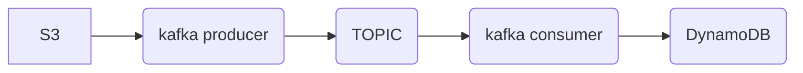

# kafkatranscriptor

## Alcance

Aplicación que toma ficheros de audio para transcribirlos y añadirlos en un fichero .csv. 

Se trata de una simulación en local de una tranferencia de audios que entrarían en tiempo real según llaman los
clientes de una aseguradora para abrir siniestros. La canalización va mediante un tópico "llamadas", son una sistema
productor-consumidor kafka. Se ha incluido para el la emulación unos ficheros audio en español de poco tamaño. 

## Componentes

__Docker__

La aplicación se despliega con servicio docker. Se incluye un docker-compose con servicios zookeeper y kafka para ello.

__Kafka__

En el docker-compose se incluye la configuración de los servidores donde se ubicarán el productor y consumidor.

__OpenAI__

Se ha seleccionado el modelo __whisper-1__ de OpenAI que transcribe audios a texto.

## Manual

En primer lugar se levanta el servicio:

```bash
sudo apt-get install docker-ce docker-ce-cli containerd.io docker-buildx-plugin docker-compose-plugin
sudo service docker start
sudo docker run hello-world
#comenzar el servidor kafka
docker-compose up -d
#comprobación de que los servidores escuchan
nc -zv localhost 22181
nc -zv localhost 29092
```

Seguidamente se ejecutan el consumidor y el productor en dos terminales diferentes:

```bash
#terminal1
python consumer.py
#terminal2
python producer.py
```
## Consideraciones

La idea de esta aplicación en producción con AWS es la siguiente:




